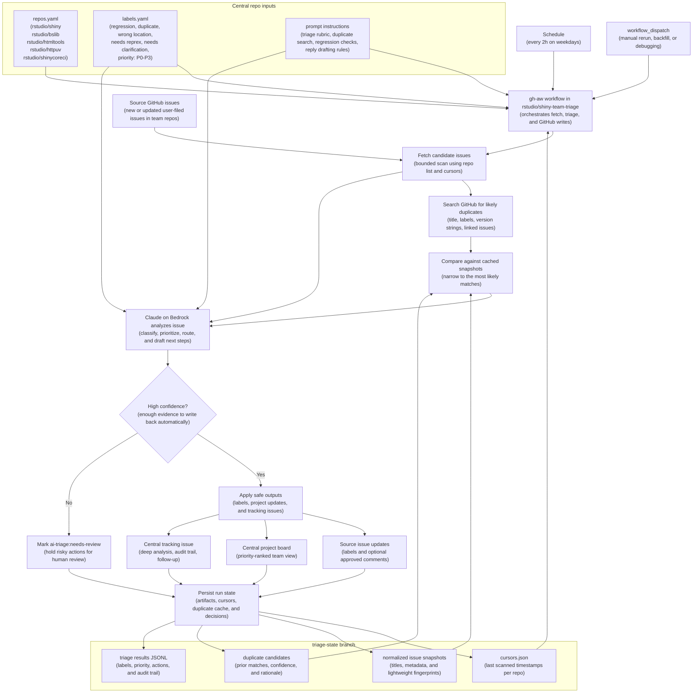

# Agentic issue triage across team repositories

This note outlines ways to run Claude, GitHub Copilot, or another coding agent on a schedule to triage newly filed user issues across a team-owned set of repositories. It is written for a team that may have many repositories and hundreds of open issues per repository, so the design favors bounded scans, a central priority view, and human review before any broad user-facing automation.

## Recommendation

Use a central GitHub-native triage repository with GitHub Agentic Workflows (`gh-aw`). If the team already has company-billed Anthropic access through Amazon Bedrock, use the Claude engine on Bedrock instead of Copilot so model usage is billed centrally rather than to individual developer subscriptions. Keep the actual GitHub writes deterministic through `gh`, GitHub API calls, and safe outputs; use the model for classification, prioritization, duplicate discovery, and deeper investigation notes.

The central workflow should:

1. Run on a fuzzy schedule, such as every 2 to 6 hours on weekdays, plus `workflow_dispatch` for manual runs.
2. Scan only new or newly updated user-filed issues from an allowlist of team repositories.
3. Add triage labels and priority labels with conservative confidence thresholds.
4. Add high-priority issues to a team-wide GitHub Projects board.
5. Maintain a centralized ranked list, ideally as a GitHub Projects view plus a generated weekly issue or discussion.
6. Produce an in-depth analysis for well-defined issues, including agentic search and regression confirmation when applicable.
7. Draft requests for more information before posting them automatically; turn on direct replies only after feedback metrics look good.

This matches the GitHub Agentic Workflows cross-repository issue-tracking pattern: component repositories feed a central tracker, the central tracker keeps cross-repo visibility, and priority-based routing sends urgent work to the right board. The reference pattern is here: <https://github.github.com/gh-aw/examples/multi-repo/issue-tracking/>.

## Table Stakes Mapping

| Requirement | Proposed implementation |
| --- | --- |
| Assign labels | Add `regression`, `duplicate`, `wrong location`, `needs reprex`, `needs clarification`, and one `priority: ...` label. Add `ai-triage:needs-review` when confidence is low. |
| Ranked priority list | Use a central GitHub Projects V2 board sorted by priority, confidence, affected repo, and age. Generate a weekly `Top Issues` report issue or discussion in the central triage repo. |
| Add high priority to team board | Add `priority: P0` and `priority: P1` issues to the team-wide project automatically. Optionally create central tracking issues for cross-repo work. |
| In-depth analysis for well-defined issues | Run a second, deeper workflow only for issues with enough detail. Require evidence, commands, links, and regression checks when the agent claims a regression. |
| Agentic search | Require the agent to search issues, PRs, changelogs, release notes, code history, and older package versions before assigning `regression` or `duplicate`. |
| Requests for more information | Start with draft comments in a project field or bot-only comment on a tracking issue. Later allow carefully templated comments on source issues. |
| Feedback mechanism | Track reviewer corrections, reaction labels, slash commands, and `ai-triage:*` labels. Use that data before expanding automation. |

## Label Taxonomy

Use a small, stable label set. The labels should exist in every participating repository and in the central triage repository.

| Label | Meaning | Auto-apply threshold |
| --- | --- | --- |
| `regression` | Current or development version appears worse than an older released version. | Only after evidence. The older version should pass or behave differently in a relevant way. |
| `duplicate` | Another open or closed issue substantially covers the same bug or request. | Require a linked candidate duplicate and short rationale. |
| `wrong location` | The issue belongs in another repository, support forum, or upstream project. | Require the target location and reason. |
| `needs reprex` | The report lacks runnable minimal code, data, app, or steps. | Safe to apply when reproduction details are missing. |
| `needs clarification` | The issue is understandable but missing expected behavior, environment, screenshots, logs, or scope. | Safe to apply when a specific missing fact can be named. |
| `priority: P0` | Production-breaking, security-sensitive, data loss, or severe release blocker. | Human review recommended before any external reply. |
| `priority: P1` | High-confidence regression or severe bug affecting many users or current release work. | Add to team project automatically. |
| `priority: P2` | Valid bug or well-defined request with moderate impact or workaround. | Track centrally, not necessarily urgent. |
| `priority: P3` | Low-impact bug, docs polish, papercut, or unclear low-severity request. | Keep in backlog view. |

Avoid letting the model invent labels. If it cannot choose from the allowed list, it should leave a note in `ai-triage:needs-review` instead.

## Priority Ranking

The centralized priority list should be a GitHub Projects V2 board with these fields:

| Field | Purpose |
| --- | --- |
| Priority | One of `P0`, `P1`, `P2`, `P3`. |
| Priority rank | Numeric value used for stable sorting, such as `100`, `75`, `50`, `25`. |
| Repository | Source repository. |
| Issue type | `bug`, `regression`, `feature`, `question`, `wrong location`, or `duplicate`. |
| Triage status | `new`, `ai-reviewed`, `human-reviewed`, `needs-info`, `accepted`, `closed`. |
| Confidence | `high`, `medium`, `low`. |
| Well-defined | Boolean or single-select field. |
| Evidence link | Link to bot analysis, workflow artifact, or tracking issue. |
| First response due | Derived from priority and created date. |

Sort the default view by priority rank, then confidence, then created date. Create secondary views for `Needs human review`, `Needs info`, `Regressions`, and `Wrong repo candidates`.

## Approach A: Central GitHub Agentic Workflow With Claude on AWS Bedrock

This is the preferred path if the team is already comfortable with GitHub Actions and `gh`, and already has Amazon Bedrock access for Anthropic models.

**Shape**

Create a central repository, for example `rstudio/shiny-team-triage`, that owns the workflows, repository allowlist, project board, prompt instructions, and generated reports. The workflow runs on a schedule, searches all participating repositories, triages only new or changed issues, then writes labels and project items back through GitHub.

**Setup sketch**

```bash
gh extension install github/gh-aw
gh aw init
gh aw new team-issue-triage --engine claude
gh aw project new "Shiny Team Triage" --owner rstudio
gh aw compile --validate --strict
gh aw run team-issue-triage
```

Use a workflow schedule such as `every 2h on weekdays` or `daily around 9am on weekdays`. GitHub Agentic Workflows supports fuzzy schedules, which spread execution times across workflows and avoid everyone running at the same minute.

**Bedrock-specific engine setup**

In `gh-aw`, this stays the `claude` engine because the runtime is Claude Code. The change is that Claude Code is configured to use Amazon Bedrock for inference and billing.

```yaml
engine:
  id: claude
  version: "2.1.94"
  max-turns: 20
  env:
    CLAUDE_CODE_USE_BEDROCK: "1"
    AWS_REGION: us-east-1
    ANTHROPIC_MODEL: global.anthropic.claude-sonnet-4-6
```

For AWS authentication, prefer GitHub Actions OIDC into an IAM role instead of storing long-lived AWS keys. If your organization uses Bedrock API keys or a central gateway, those can also work, but OIDC plus IAM is the cleaner default for a scheduled workflow.

```yaml
steps:
  - name: Configure AWS credentials
    uses: aws-actions/configure-aws-credentials@v4
    with:
      role-to-assume: arn:aws:iam::123456789012:role/gh-aw-triage
      aws-region: us-east-1
```

One caveat: `gh-aw`'s public docs still describe the Claude engine's default auth path as `ANTHROPIC_API_KEY`. Claude Code itself supports Amazon Bedrock directly, but this Bedrock path is a manual Claude Code configuration rather than the default `gh aw secrets bootstrap --engine claude` happy path. Test it in a trial repository before rolling it into production.

The central workflow should read a checked-in config file like this:

```yaml
repositories:
  - rstudio/shiny
  - rstudio/bslib
  - rstudio/htmltools
  - rstudio/httpuv
  - rstudio/shinycoreci

labels:
  classification:
    - regression
    - duplicate
    - wrong location
    - needs reprex
    - needs clarification
  priority:
    - priority: P0
    - priority: P1
    - priority: P2
    - priority: P3

project:
  owner: rstudio
  title: Shiny Team Triage
  add_priorities:
    - priority: P0
    - priority: P1
```

**Workflow diagram**



**Where the data lives**

Approach A should use GitHub as the system of record, with a small amount of derived state stored in the central triage repository.

| Data | Where it lives | Why |
| --- | --- | --- |
| Original issue text, comments, labels, close state, cross-links | The source repository issue itself | This is the canonical source of truth. Do not copy this into another database unless the GitHub-native approach stops scaling. |
| Current triage status, priority, assignee/reviewer state, and ranked backlog view | The central GitHub Projects V2 board | This is the operational view the team uses day to day. |
| Cross-repo tracking notes and deep analysis summaries | Central tracking issues or discussions in `rstudio/shiny-team-triage` | Keeps durable human-readable history in one place. |
| Workflow configuration, repository allowlist, label allowlist, prompt instructions | Checked-in files in `rstudio/shiny-team-triage` | Versioned, reviewable, and easy to change by pull request. |
| Incremental scan cursors and machine-readable run history | A tracked branch such as `triage-state` or `triage-runs`, stored as JSON or JSONL files | Lets the workflow avoid rescanning everything and preserves evidence for review. |
| Optional duplicate-search cache | Files in that same `triage-state` branch, for example normalized issue snapshots, candidate duplicate links, and lightweight fingerprints | Improves duplicate detection without needing a separate service on day 1. |

The minimal GitHub-native state layout looks like this:

```text
rstudio/shiny-team-triage
  config/repos.yaml
  config/labels.yaml
  prompts/team-issue-triage.md

triage-state branch
  state/cursors.json
  state/issues/rstudio-shiny.jsonl
  state/issues/rstudio-bslib.jsonl
  state/triage-results/2026-04-27.jsonl
  state/duplicates/candidates.jsonl
```

For duplicate detection, the workflow should not rely on a hidden model memory. It should do three things on each run:

1. Query GitHub directly for likely matches across the participating repositories by title, labels, code snippets, version strings, and linked issues.
2. Compare the new issue against the cached normalized issue snapshots in `triage-state` so it only has to consider a bounded candidate set.
3. Store the chosen duplicate candidate, confidence, and rationale back into `triage-results` or a central tracking issue so humans can audit the decision.

That means the answer to "where is the information stored" is: mostly in GitHub already, plus a small checked-in or branch-backed index in the central triage repo to make incremental scans and duplicate checks efficient.

**Pros**

- Best fit for a team that wants GitHub-native orchestration but company-billed Anthropic usage.
- Keeps scheduling, audit logs, permissions, and outputs inside GitHub.
- Cross-repo scans and central tracking match the `gh-aw` multi-repo issue-tracking pattern.
- Uses AWS IAM, Bedrock model access controls, and centralized cloud billing instead of individual Copilot seats.
- Still allows switching engines later if the team wants to compare Copilot, Claude, Codex, or Gemini.
- Can use `gh aw logs`, `gh aw audit`, and workflow artifacts for observability.

**Cons**

- `gh-aw` is newer than plain GitHub Actions, so the team should pin versions and validate workflows in CI.
- Bedrock is not the default documented `gh-aw` auth path for the Claude engine, so setup is slightly more manual than the standard `ANTHROPIC_API_KEY` route.
- Project writes need a token with Projects permissions; the default `GITHUB_TOKEN` is not enough for all project operations.
- The team still needs careful prompt and output policy design to avoid noisy labels or unwanted comments.

**Best for**

The main production path after a short dry run.

## Approach B: Plain GitHub Actions Plus A Deterministic Triage Script

**Shape**

Write a scheduled GitHub Actions workflow that runs a script in Python, R, Node.js, or shell. The script uses `gh search issues`, `gh issue view`, `gh issue edit`, `gh api graphql`, and model API calls. The model returns structured JSON; the script validates the JSON and applies labels/project updates.

**Setup sketch**

1. Create `.github/workflows/team-issue-triage.yml` in a central repo.
2. Store a repository allowlist and label taxonomy in `triage-config.yaml`.
3. Query candidate issues using `gh search issues` or GraphQL.
4. Call the chosen model with a strict JSON schema.
5. Validate the response against the allowed label list.
6. Apply labels with `gh issue edit` and add project items through GraphQL.
7. Upload JSONL artifacts for review and metrics.

**Pros**

- Maximum control and easy to test locally.
- Model vendor can be swapped behind a small interface.
- Easier to build custom batching, retries, caching, and metrics.
- No dependency on `gh-aw` workflow compilation.

**Cons**

- More code to maintain.
- The team owns prompt-injection defenses, token handling, schema validation, and observability.
- Less naturally integrated with safe outputs and agentic workflow audit tooling.

**Best for**

Teams that want a conservative, fully owned service but still want to stay inside GitHub Actions.

## Approach C: Per-Repository Agentic Workflows

**Shape**

Install a small issue-triage workflow in every participating repository. Each workflow runs on `issues: opened` and optionally on a schedule. It labels local issues immediately, then sends high-priority items to the central project or tracking repository.

**Pros**

- Fast response on newly opened issues.
- Local repository context is available by default.
- Permissions can be scoped to each repository.
- Easier for individual repository owners to tune instructions.

**Cons**

- Harder to keep prompts, labels, and thresholds consistent across many repositories.
- Global priority ranking is an afterthought unless each repo also reports to a central board.
- Multiplies workflow runs and maintenance work.

**Best for**

High-volume repositories that need immediate first-pass labeling, used as a complement to the central workflow.

## Approach D: External Agent Service

**Shape**

Run a hosted service on a scheduler, queue, and database. It uses a GitHub App for repository access and calls Claude, Copilot-compatible endpoints, or another model. It owns state, deduping, project updates, and feedback collection.

**Pros**

- Strongest scaling model for very large organizations.
- Durable queue and database make retries, backfills, and metrics straightforward.
- Easy to run deeper analysis jobs that need long timeouts or custom containers.
- Can compare model vendors and prompts systematically.

**Cons**

- More infrastructure, security review, maintenance, and incident surface.
- Less visible to maintainers than GitHub-native Actions logs.
- Needs careful handling of private repository data and model data-retention terms.

**Best for**

Later, if the GitHub-native approach hits queue, runtime, observability, or cost limits.

## Approach E: Reports First, No Automatic Writes

**Shape**

Run a scheduled agent that only creates a central triage report. Humans apply labels and comments manually from the report.

**Pros**

- Lowest risk.
- Useful for validating labels, prompts, ranking, and model quality.
- No accidental public comments or incorrect labels.

**Cons**

- Does not reduce manual work as much.
- Priority board and labels can lag behind user reports.

**Best for**

The first 1 to 2 weeks of rollout, before enabling write operations.

## Scaling Across Repositories With Large Issue Counts

The system should never scan every open issue in every repo on every run. Treat the 800 existing issues per repo as backlog data, not as the recurring workload.

Use these rules:

1. Maintain an allowlist of repositories owned by the team.
2. Exclude pull requests, bots, internal-only automation issues, and issues already marked `ai-triage:done` or `human-reviewed`.
3. Store a cursor per repository, such as last scanned `createdAt` and `updatedAt` timestamps.
4. On each scheduled run, fetch only issues created or updated after the cursor.
5. Cap each run, for example `max_issues_per_repo: 25` and `max_issues_total: 150`.
6. Use a separate backfill workflow for old issues, capped at a small number per repo per day.
7. Do cheap deterministic filtering before model calls: labels, author type, template completeness, linked repo, error signatures, and version strings.
8. Run deep analysis only for issues that are well-defined, high-impact, or likely regressions.

A typical recurring query can be driven by GraphQL or `gh search issues`, for example:

```bash
gh search issues "org:rstudio is:issue is:open created:>=2026-04-27 -author:app/dependabot" \
  --limit 200 \
  --json title,url,number,createdAt,updatedAt,labels
```

The production implementation should prefer GraphQL for repository-aware pagination, Projects V2 fields, and exact cursors.

## In-Depth Analysis Instructions For Well-Defined Issues

An issue is well-defined when it includes enough information to test or reason about the claim: package version, R version, OS/browser when relevant, expected behavior, actual behavior, code or app steps, logs/screenshots, and a clear affected package or repository.

For those issues, the agent should produce an analysis with this structure:

1. **Facts from the report**: summarize only what the reporter actually provided.
2. **Classification hypothesis**: bug, regression, duplicate, wrong repo, feature request, or needs info.
3. **Repository context search**: search existing issues, merged PRs, recent releases, changelogs, NEWS, tests, and relevant source files.
4. **Duplicate check**: list candidate duplicates and explain why they do or do not match.
5. **Wrong-location check**: identify whether another team repo or upstream dependency is the better home.
6. **Regression check**: if the issue may be a regression, test or reason across versions. Do not label as `regression` unless the evidence shows older behavior differs materially.
7. **Reproduction plan**: include commands, minimal app, or test idea. If a true reprex is missing, apply `needs reprex` instead.
8. **Impact and priority**: assign `P0` to `P3` with a brief rationale.
9. **Recommended next action**: label only, add to project, ask for info, route to another repo, or escalate to a maintainer.

For R/Shiny repositories, regression confirmation should use isolated libraries when possible:

```bash
mkdir -p /tmp/triage-current /tmp/triage-previous
R_LIBS_USER=/tmp/triage-current Rscript -e 'pak::pkg_install("rstudio/shiny"); sessioninfo::session_info()'
R_LIBS_USER=/tmp/triage-previous Rscript -e 'pak::pkg_install("shiny@1.10.0"); sessioninfo::session_info()'
```

The exact package and version should come from the issue, release history, or the suspected regression window. If the agent cannot run the repro, it should say so and provide the best next command for a human maintainer.

## Replying To Users

Start with no direct public replies. During the dry-run period, write suggested replies into a central tracking issue, workflow artifact, or project field.

When enabling replies, keep them narrow:

- Ask for one to three specific missing facts.
- Do not apologize on behalf of the team unless a human reviewed the issue.
- Do not promise fixes, timelines, or ownership.
- Do not close issues automatically.
- Include a lightweight marker so automation can find its own comments later.

Example request template:

```markdown
Thanks for the report. Could you add a small reprex that shows the behavior, plus your `sessioninfo::session_info()` output? The most useful details are the Shiny version, R version, browser/OS, expected result, and actual result.

<!-- ai-triage:request-info v1 -->
```

For wrong-location suggestions, prefer a draft first because routing mistakes feel noisy to users:

```markdown
This looks like it may belong in `rstudio/htmltools` because the failing behavior is in tag rendering rather than Shiny server logic. A maintainer should confirm before routing.

<!-- ai-triage:wrong-location-draft v1 -->
```

## Feedback Mechanism

Add explicit review labels:

- `ai-triage:needs-review`
- `ai-triage:accepted`
- `ai-triage:corrected`
- `ai-triage:bad-label`
- `ai-triage:bad-comment`

Track feedback in three places:

1. GitHub Projects fields for reviewer outcome and corrected priority.
2. JSONL artifacts or a central `triage-runs` branch containing model output, labels applied, reviewer changes, and run metadata.
3. Weekly reports showing precision by label, false-positive regressions, duplicate accuracy, and comment edits.

Useful slash commands for maintainers:

```text
/ai-triage accept
/ai-triage wrong-label regression
/ai-triage approve-comment
/ai-triage never-comment
```

Only expand automatic replies once the team has measured a stable low correction rate for several weeks.

## Security And Safety

Issue bodies are untrusted input. The workflow instructions should explicitly tell the model to treat all issue content as data, ignore instructions embedded in issues, and never expose tokens or private repository data in comments.

Use these controls:

- Prefer a GitHub App or fine-grained PAT scoped to the exact repositories.
- Use read-only permissions for analysis jobs and a separate constrained writer step for labels, comments, and project updates.
- Use `gh-aw` safe outputs where possible.
- Restrict labels to an allowlist.
- Restrict comments to approved templates until the feedback loop is proven.
- Never auto-close, auto-transfer, or auto-assign maintainers outside an allowlist.
- Keep private issue details out of public central reports.

## Rollout Plan

1. **Week 1: report only**. Run scheduled scans, generate central reports, collect human feedback, and do not mutate source issues.
2. **Week 2: labels only**. Apply safe labels and priority labels when confidence is high. Continue drafting comments only.
3. **Week 3: project automation**. Add `P0` and `P1` issues to the team project and generate weekly top-priority reports.
4. **Week 4: reviewed replies**. Allow maintainers to approve suggested replies with a slash command or project field.
5. **Later: limited automatic replies**. Auto-post only low-risk `needs reprex` and `needs clarification` requests, with ongoing metrics and quick disable switches.

## Summary Recommendation

Start with Approach A plus Approach E: build the central `gh-aw` workflow using the Claude engine on Amazon Bedrock and `gh`, but run it in report-only mode first. Once the ranking and labels look good, turn on label writes, then project writes, then reviewed replies. Keep per-repo workflows as an optional fast path for the busiest repositories, and reserve an external service for a later phase if GitHub Actions runtime, Projects API complexity, or model evaluation needs outgrow the central workflow.