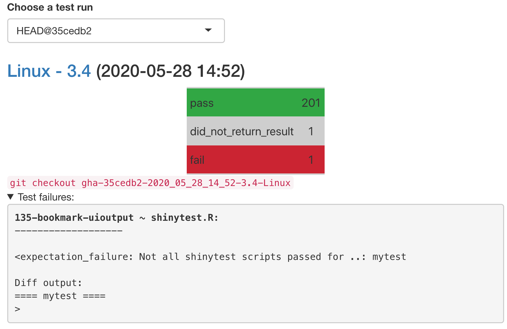

---
output:
  md_document:
    variant: gfm
    pandoc_args: "--wrap=preserve"
# devtools::build_readme()
---

<!-- README.md is generated from README.Rmd. Please edit that file -->

```{r, include = FALSE}
knitr::opts_chunk$set(
  collapse = TRUE,
  comment = "#>",
  fig.path = "man/figures/README-",
  out.width = "100%"
)
```

# shinycoreci

<!-- badges: start -->
[](https://www.tidyverse.org/lifecycle/#experimental)
[](https://github.com/rstudio/shinycoreci/actions/workflows/R-CMD-check.yaml)
[](https://github.com/rstudio/shinycoreci/actions/workflows/apps-cache-matrix.yml)
[](https://github.com/rstudio/shinycoreci/actions/workflows/apps-test-matrix.yml)
[](https://github.com/rstudio/shinycoreci/actions/workflows/apps-deploy.yml)
[](https://github.com/rstudio/shinycoreci/actions/workflows/apps-docker.yml)
[](https://github.com/rstudio/shinycoreci/actions/workflows/apps-deps.yml)
<!-- badges: end -->

<!-- This is an R package to install all dependencies to test the bleeding edge of all relevant packages to the Shiny team. -->

<!-- For more direct usage examples, see [`rstudio/shinycoreci-apps`](https://github.com/rstudio/shinycoreci-apps). -->


## Installation

Install the development version from [GitHub](https://github.com/) with:

``` r
# install.packages("pak", repos = sprintf("https://r-lib.github.io/p/pak/stable/%s/%s/%s", .Platform$pkgType, R.Version()$os, R.Version()$arch))
pak::pkg_install("rstudio/shinycoreci")
```

These GitHub packages will be installed to make sure the latest package development is working as expected:

```{r, echo = FALSE, results = "asis"}
pkgs <- shinycoreci:::shinyverse_remotes

# remove branches, sha, and commas
github_pkgs <- sub("[, (@#].*$", "", pkgs)

# print as links to repos
cat(
  paste0(
    "* [", pkgs, "](http://github.com/", github_pkgs, ")",
    collapse = "\n"
  )
)
```


Tools for manual and automated testing of shiny apps.

## Running manual tests

First, install the `{shinycoreci}` repo via {pak} (from instructions above). Before running any tests, you may need to add your `GITHUB_PAT` to your R Environ file (See `?usethis::edit_r_environ` and `?usethis::browse_github_pat`)

Commands used to test in different situations:

* [RStudio IDE](https://rstudio.com/products/rstudio/download/#download) - `shinycoreci::test_in_ide()`
* [RStudio Cloud](http://rstudio.cloud) - `shinycoreci::test_in_ide()`
* [RStudio Server Pro](https://colorado.rstudio.com) - `shinycoreci::test_in_ide()`
* R Terminal / R GUI - `shinycoreci::test_in_browser()`
* (Any) Web Browser - `shinycoreci::test_in_browser()`
* [shinyapps.io](http://shinyapps.io) - `shinycoreci::test_in_shinyappsio()`
* [RStudio Connect](http://beta.rstudioconnect.com) - `shinycoreci::test_in_connect()`
* SSO - `shinycoreci::test_in_sso(release = "focal")`
  > will require docker login. Run `docker login` in the terminal
* SSP - `shinycoreci::test_in_ssp(release = "centos7")`
  > will require docker login. Run `docker login` in the terminal

All testing functions may be run from within the IDE (except for R Terminal / R GUI).

#### IDE Example

```r
# install.packages("pak", repos = sprintf("https://r-lib.github.io/p/pak/stable/%s/%s/%s", .Platform$pkgType, R.Version()$os, R.Version()$arch))

# Install the latest from pak
pak::pkg_install("rstudio/shinycoreci")

# Install shinyverse
# Run all manual tests
shinycoreci::test_in_ide()
```

## View the latest test results


To view the latest test results, please visit https://rstudio.github.io/shinycoreci/results/. This link will update to the latest results when they are pushed.

<!-- Use `shinycoreci::view_test_results()` to obtain an overview of the most recent test runs (it should prompt a **shiny** app that looks similar to this):

<div align="center">
  
</div> -->

If you see failures, this indicates that a test has failed.  If it is related to a `{shinytest2}` snapshot failure, we can view and approve these failures with `shinycoreci::fix_snaps()`. Your working directory must be in a local checkout of the `rstudio/shinycoreci` repo.  Once `shinycoreci::fix_snaps()` has finished running, use [GitHub Desktop](https://desktop.github.com/) to view the changes.

If you receive the error `No information found for sha: ABC1234 . Do you have a valid sha?`, you may have to provide the git sha value directly: `shinycoreci::fix_snaps(sha = "XYZ5678")`.

In the event that all testing failures can not be addressed by updating `{shinytest2}` baselines, have a look at the [GHA actions](https://github.com/rstudio/shinycoreci/actions) build log and keep the following troubleshooting tips in mind:

### Troubleshooting test failures

1. Failures on old versions of R

If a testing app passes on recent version(s) of R, but fails in a suprising way on old R version(s), it may be due to an old R package version. In that case, modify the tests to run only if a sufficient version of the relevant package is available ([for example](https://github.com/rstudio/shinycoreci/blob/d8f627bea573cf7bb7a53788522f04d90aeb557f/inst/apps/145-dt-replacedata/tests/testthat/test-mytest.R)).

2. Other failures that can't replicated locally

Other surprising failures are often the result of timing issues (which can be difficult, if not impossible, to replicate locally). If your testing app uses dynamic UI and/or doesn't have proper input/output bindings, **shinytest2** probably needs to know how long to wait for value(s) to update (in this case, use `app$wait_for_idle()`, [for example](https://github.com/rstudio/shinycoreci/blob/46cdf9df12ee665d5ac77f85eb22f511ce8a4fe6/inst/apps/135-bookmark-uioutput/tests/testthat/test-mytest.R#L6)). Somewhat similarly, when checking DOM values with **shinyjster**, you may need to wait for an update to DOM element(s) before checking value(s), in which case you can write a recursive function that keeps calling itself until the DOM is ready ([for example](https://github.com/rstudio/shinycoreci/blob/46cdf9df12ee665d5ac77f85eb22f511ce8a4fe6/inst/apps/187-navbar-collapse/app.R#L27-L36)).

3. All of the windows shinytest plots have failed

When Windows virtual images update on GitHub Actions, the graphics device may behave exactly as the prior graphics device. Check to see if your windows `Image Version` has updated. (To view this, inspect the top lines in `./inst/apps/sys-info-win-XX.txt` for a change.)  You should accept the updated shinytest output for the build with the higher `Image Version`.

## Contribute a testing app

When contributing a testing app, try to do the following:

* Capture all the functionality with automated tests.
  * Also, where possible, write "light-weight" tests (that is, try and avoid **shinytest2** `$expect_screenshot()` where possible since they are prone to false positive differences and thus have a maintenance cost).
  * If the app does need manual testing, flag the testing app for manual testing with `shinycoreci::use_manual_app()`.
* Add a description to the app's UI that makes it clear what the app is testing for.

Note that **shinycoreci** only supports `{testthat}` testing framework. Call `shinytest2::use_shinytest2(APP_DIR)` to use `{shinytest2}` and `{testthat}`

1. **shinytest2**: primarily useful for taking screenshots of shiny output binding(s) (before or after interacting with **shiny** input bindings). [See here](https://github.com/rstudio/shinycoreci/blob/d8f627bea573cf7bb7a53788522f04d90aeb557f/inst/apps/001-hello/tests/testthat/test-mytest.R) for an example (note that `shinytest2::record_test()` can be used to generate shinytest2 testing scripts).

2. **shinyjster**: primarily useful for asserting certain expectations about the DOM (in JavaScript). [See here](https://github.com/rstudio/shinycoreci-apps/blob/5691d1f/apps/001-hello/app.R#L37-L61) for an example (note that `shinyjster::shinyjster_js()` needs to be placed in the UI and `shinyjster::shinyjster_server(input, output)` needs to be placed in the server).

3. **testthat**: primarily useful in combination with `shiny::testServer()` to test server-side reactive logic of the application.
  * [See here](https://github.com/rstudio/shinycoreci-apps/blob/5691d1f4/apps/001-hello/tests/testthat/tests.R#L4) for an example.


## Pruning old git branches

To help us store and manage the test results, git branches are automatically created for each test run. These branches are automatically removed on GitHub after 1 week of no activity, but you may want to periodically remove them on your local machine as well:

```bash
git fetch --prune
```

## What workflows are available?

This repo contains several [GitHub Actions](https://github.com/features/actions) workflows:

* [**runTests:**](https://github.com/rstudio/shinycoreci-apps/actions?query=workflow%3ArunTests) Run the automated tests (via `shiny::runTests()`).
* [**Docker:**](https://github.com/rstudio/shinycoreci-apps/actions?query=workflow%3ADocker) Create all SSO and SSP docker images
* [**Deploy**](https://github.com/rstudio/shinycoreci-apps/actions?query=workflow%3ADeploy): Deploy all testing apps to [shinyapps.io](shinyapps.io) and [beta.rstudioconnect.com](https://beta.rstudioconnect.com)

The **runTests** workflow runs automatically on every code change to `shinycoreci-apps` as well as every night (around midnight UTC). The other workflows may be triggered via `shinycoreci::trigger_docker()` and `shinycoreci::trigger_deploy()`


### `build-results.yml`

Goal: After `apps-test-matrix.yml` has completed, process all results in `_test_results` branch into static files and push new outputs to `gh-pages` website

Final website location of results: https://rstudio.github.io/shinycoreci/results/

#### Actions performed

On completion of `apps-test-matrix.yml`...

* GHA will check out the latest `_test_results` branch into the local folder.
* GHA will check out the latest `gh-pages` branch into the `./_gh-pages` folder.
* GHA will install R and necessary package dependencies.
* Run `./build_site.R`
  * Read the *modify times* of each file in `_test_results` and processing files
  * Compare *modify times* to *modify times* of output files
  * If any input file is newer than the output file, reprocess the documen
  * If reprocessing, render `./render-results.Rmd` given proper subset of data
    * Save output to `./_gh-pages/results/YEAR/MONTH/DAY/index.html
  * Update `./_gh-pages/results/index.html` to redirect to the most recent results
* Within the `./_gh-pages` directory
  * Add any files that have been altered
  * Commit and push back any changes to the `gh-pages` website
    * Final results are


# FAQ:

If you run into an odd `{pak}` installation issue:

* Run `pak::cache_clean()` to clear the cache and try your original command again
